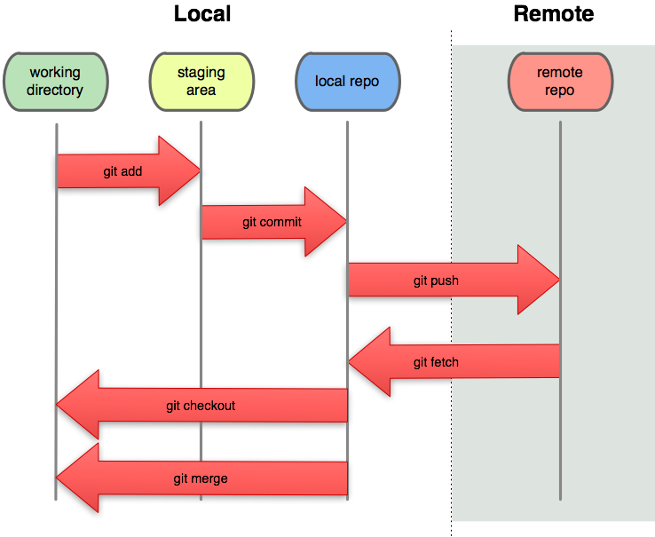

## Git Basics {style="color: #1CA152;"}




## Create a Quarto Blog with VS Code {style="color: #1CA152;"}

**View** → **Command Palette** → **Quarto: Create New Project** → **New Directory** → **Blog Website** → **Name your project** → **Select a folder to save your project** → **Create Project**.

## Publish your Quarto Blog to GitHub Pages {style="color: #1CA152;"}

**1.** Create a repository on GitHub.
No need to initialize the repository with a README, .gitignore, or license.

**2.** In VS Code, open the blog’s project folder. In the terminal, run these commands, replacing `USERNAME` with your GitHub username:

   ```bash
   git init -b main
   git add .
   git commit -m "Add Quarto blog"
   git remote add origin https://github.com/USERNAME/RR_Blog_2026.git
   git push -u origin main
   ```

**3.** Create `.github/workflows/publish.yml` in the project and add the workflow shown below.

```bash
name: Publish Quarto site

on:
  push:
    branches: [main]
  workflow_dispatch:

permissions:
  contents: write

jobs:
  publish:
    runs-on: ubuntu-latest
    steps:
      - name: Check out repository
        uses: actions/checkout@v4

      - name: Set up Quarto
        uses: quarto-dev/quarto-actions/setup@v2

      - name: Publish to GitHub Pages
        uses: quarto-dev/quarto-actions/publish@v2
        with:
          target: gh-pages
        env:
          GITHUB_TOKEN: ${{ secrets.GITHUB_TOKEN }}
          ```

**4.** Push the workflow to GitHub:

   ```bash
   git add .github/workflows/publish.yml
   git commit -m "Add GitHub Pages publishing workflow"
   git push
   ```

**5.** On GitHub, go to **Settings → Pages**. Under **Build and deployment**, choose **Deploy from a branch**, then select the `gh-pages` branch and `/(root)` folder.

**7.** Go to Actions to check the status of your workflow. If it fails, check the logs for errors and fix them. 

**7.** When the GitHub Actions workflow succeeds, you can access your blog from **Pages** → Visit site
 
