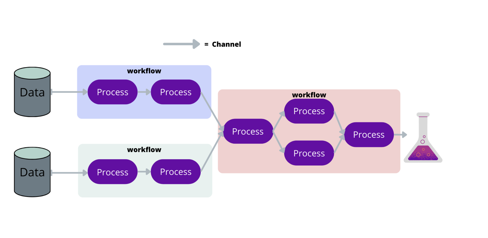

## Nextflow Basics {style="color: #1CA152;"}

Nextflow is a workflow management system that enables scalable and reproducible scientific workflows. It allows us to write complex pipelines in a simple and readable manner, while also providing support for parallel execution and integration with various computing environments.

Learn more about Nextflow here: [Nextflow Documentation](https://www.nextflow.io/docs/latest/index.html)

## Setting up an nf-core Pipeline {style="color: #1CA152;"}

## Thumbnail credits {style="color: #1CA152;"}

Gustav Klimt, *The Park* (c. 1910). Public domain image via Wikimedia Commons.https://commons.wikimedia.org/wiki/File:Gustav_Klimt_032.jpg
